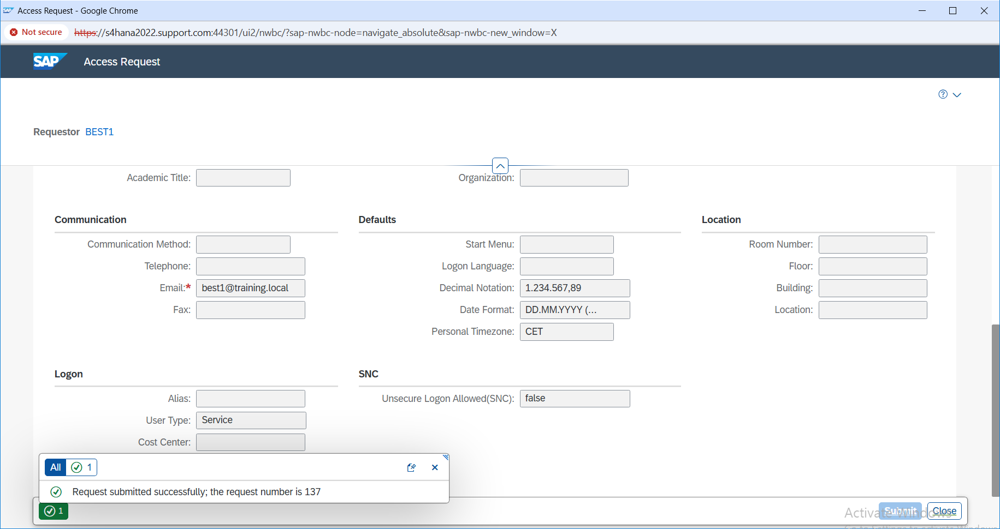
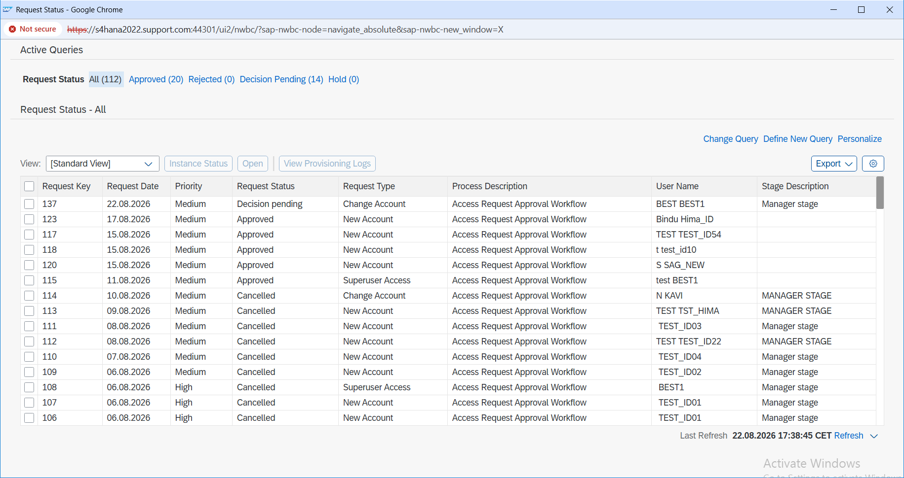

# Access Request Creation and Submission

## Overview

In this part of the project, I created an access request for user `BEST1` in SAP GRC.

The user needed temporary access to role `ZS:ALLUSER` in system `TESTGRC447`.

Before submitting the request, I reviewed the user details, requested role, target system, validity dates, and business reason to make sure the request information was correct.

---

## Access Request Details

| Detail | Value |
|---|---|
| Request Number | 137 |
| User | BEST1 |
| Request Type | Change Account |
| Priority | Medium |
| Requested Role | ZS:ALLUSER |
| System | TESTGRC447 |
| Valid From | 22-Aug-2026 |
| Valid To | 30-Sep-2026 |

The access was requested only for a limited period, so I maintained the required validity dates instead of giving the user permanent access.

---

## What I Did

I created the request for user `BEST1` and added the required role `ZS:ALLUSER`.

I selected the target system `TESTGRC447` and maintained the required access validity period.

I also added the business reason for why the access was required.

After checking the request details, I submitted Access Request `137` into the approval workflow.

---

## Evidence

### E13 – Access Request 137 Submitted

This screenshot shows that Access Request `137` was created and submitted successfully.

It confirms the user, requested access, and request number used in this project.

---

### E14 – Request 137 Decision Pending

After submitting the request, I checked the request status.

The request was in a pending decision stage, which confirmed that it had entered the approval workflow and was waiting for the next approver action.

---

## Result

Access Request `137` was successfully created for user `BEST1` and submitted into the SAP GRC approval workflow.

At this stage, the request was ready to move through the required approval process.