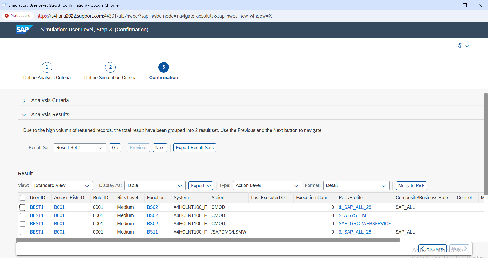

# Preventive Risk Simulation

## Overview

In this step, I performed a preventive risk simulation before the access request moved further in the approval process.

The purpose of this check was to see whether the requested access would create any Segregation of Duties (SoD) conflict for user `BEST1`.

The simulation identified risk `B001`, so I reviewed the risk details before continuing with the request.

---

## Risk Details

| Detail | Value |
|---|---|
| User | BEST1 |
| Risk ID | B001 |
| Rule ID | 0001 |
| Risk Level | Medium |
| Conflicting Functions | BS02 and BS11 |
| Conflicting Actions | CMOD and /SAPDMC/LSMW |
| Requested Role | ZS:ALLUSER |
| System | TESTGRC447 |

---

## What I Did

I ran the risk simulation for the requested access and reviewed the result.

The analysis showed that the requested role was creating SoD risk `B001`.

I checked the risk level, conflicting functions, conflicting actions, role, and target system to understand where the conflict was coming from.

Since the access was still required for the business scenario, I continued with the request and later handled the risk through a mitigating control instead of removing the access.

---

## Evidence

### E12 – Preventive Risk Simulation

This screenshot shows the preventive risk analysis result for the requested access.

It confirms that risk `B001` was identified for user `BEST1` and shows the related functions, actions, role, system, and risk level.

---

## Result

The preventive risk simulation successfully identified SoD risk `B001` before the access request was fully approved.

This gave me a clear view of the conflict and helped me decide that the risk needed to be handled through mitigation.