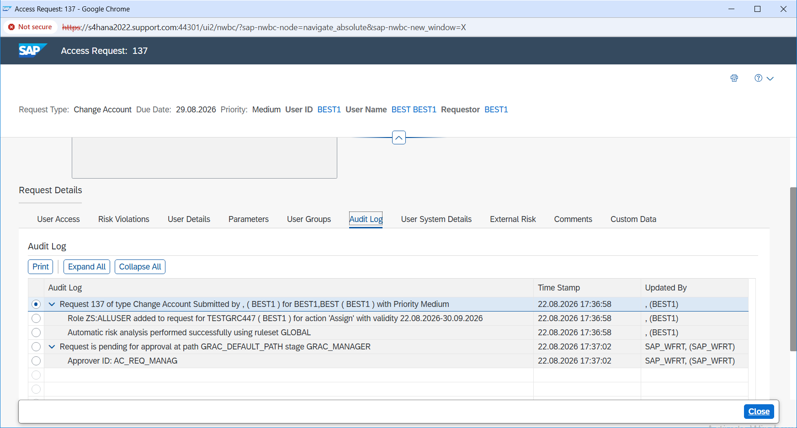
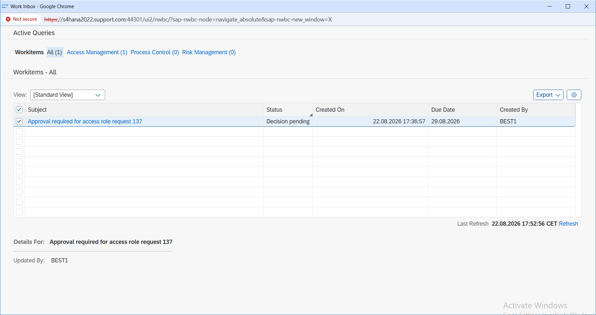
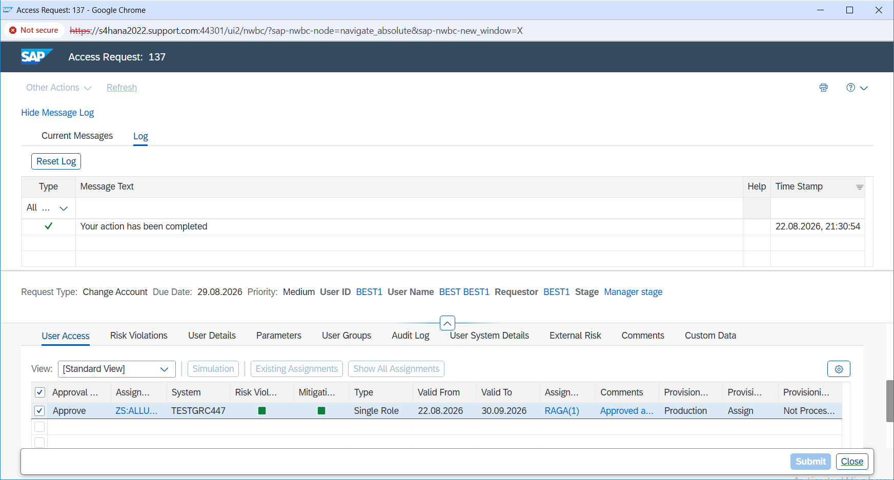
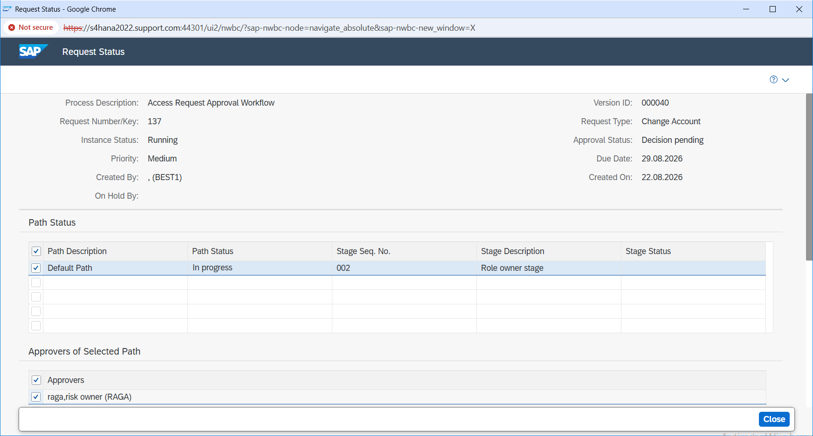
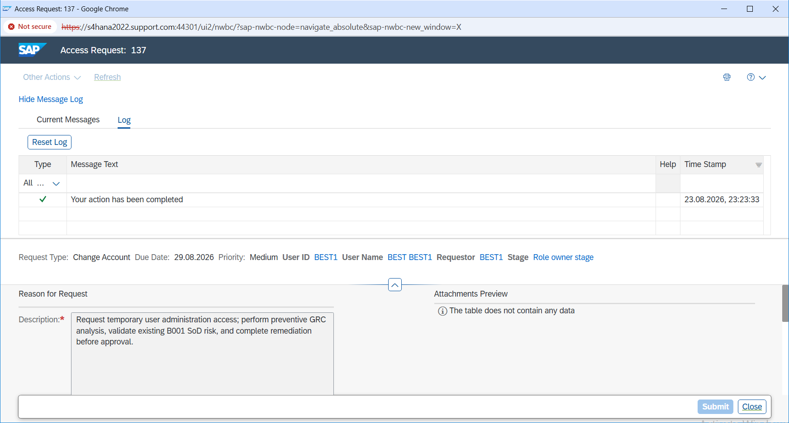

# Workflow Approval and Provisioning

## Overview

In this step, I followed Access Request `137` through the approval workflow.

After the request was submitted, I checked how it was routed, reviewed the manager approval stage, verified the role-owner approval, and then checked the provisioning log.

This helped me confirm that the request was not only approved, but also processed through the expected workflow stages.

---

## What I Did

I first reviewed the workflow routing and audit log for Request `137`.

This helped me understand which approval stage the request was in and how it was moving through the workflow.

The request first went to the manager approval stage.

I reviewed the manager work item and verified that the manager approval was completed successfully.

After that, the request moved to the role-owner approval stage.

I checked the role-owner approval and confirmed that this stage was also completed.

Once both approvals were done, I reviewed the provisioning log to make sure the access request had moved beyond approval and was actually processed by the system.

---

## Evidence

### E15 – Workflow Routing and Audit Log

This screenshot shows the workflow routing and audit information for Access Request `137`.

It helped me track how the request moved through the approval process.

---

### E16 – Manager Approval Work Item

This screenshot shows the manager approval work item for the request.

At this stage, the request was waiting for the manager decision.

---

### E17 – Manager Approval Completed

This screenshot confirms that the manager approval was completed successfully.

After this approval, the request was able to move to the next stage in the workflow.

---

### E18 – Role Owner Approval Stage

After manager approval, the request moved to the role-owner approval stage.

This screenshot shows that the requested role was being reviewed by the role owner.

---

### E19 – Role Owner Approval Completed

This screenshot confirms that the role-owner approval was also completed successfully.

At this point, the required approval stages were finished.

---
## Result

Access Request `137` successfully moved through the manager approval and role-owner approval stages.

I also verified the workflow audit information and provisioning log to confirm that the request was processed successfully after approval.

This step helped me understand the full approval flow instead of only checking the final approval status.