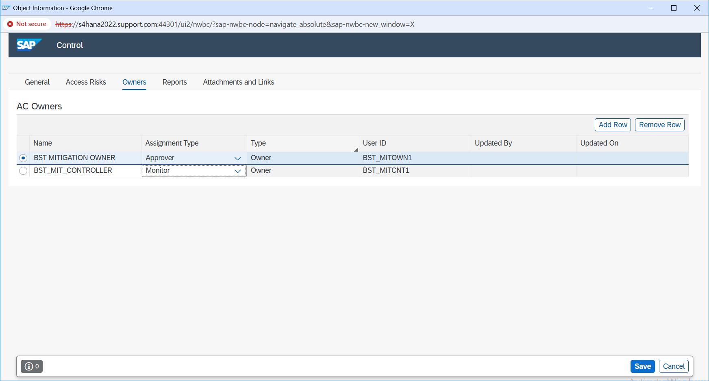
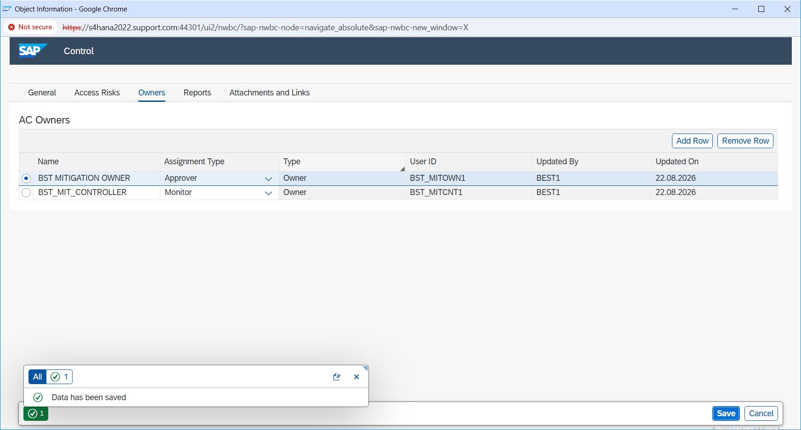

# Mitigating Control Configuration

## Overview

In this step, I worked on the mitigating control for the SoD risk identified during the risk analysis.

The access was still required for the business scenario, so instead of removing the requested access, I handled the risk by configuring mitigating control `MC_B001`.

My focus was to make sure the control had the right responsibility setup before assigning it to the user.

---

## Mitigation Details

| Detail | Value |
|---|---|
| Risk ID | B001 |
| Mitigating Control | MC_B001 |
| Target System | TESTGRC447 |
| Mitigation Approver | BST_MITOWN1 |
| Control Monitor | BST_MITCNT1 |

---

## What I Did

I opened the mitigating control setup and reviewed the control details for `MC_B001`.

I then maintained the responsibility setup for the control.

I assigned `BST_MITOWN1` as the mitigation approver and `BST_MITCNT1` as the control monitor.

I kept these responsibilities with two different users so the same person was not responsible for both approving and monitoring the mitigation.

After reviewing the setup, I saved the control configuration and confirmed that the responsibility assignments were maintained successfully.

This made the control ready to be used for the user mitigation assignment.

---

## Why This Step Was Important

Finding the SoD risk was only the first part of the process.

Since the user still needed the access, the risk had to be managed in a controlled way.

The mitigating control helped provide that additional review and monitoring.

Keeping the approver and monitor separate also helped maintain clear responsibility in the mitigation process.

---

## Evidence

### E20 – Mitigation Control Responsibilities

This screenshot shows the responsibility setup for mitigating control `MC_B001`.

It shows that `BST_MITOWN1` was maintained as the mitigation approver and `BST_MITCNT1` as the control monitor.

I used separate users for these responsibilities so approval and monitoring were not handled by the same person.

---

### E21 – Mitigation Control Owner and Monitor Saved

This screenshot confirms that the responsibility setup for mitigating control `MC_B001` was saved successfully.

It shows the separate approver and monitor assignments and confirms that the control configuration was ready for the next step.

---

## Result

Mitigating control `MC_B001` was successfully configured with separate approval and monitoring responsibilities.

The control setup was saved successfully and was ready to be assigned to user `BEST1` for risk `B001`.

This step helped make sure the identified risk was not only documented, but also supported by a proper mitigation and responsibility structure.