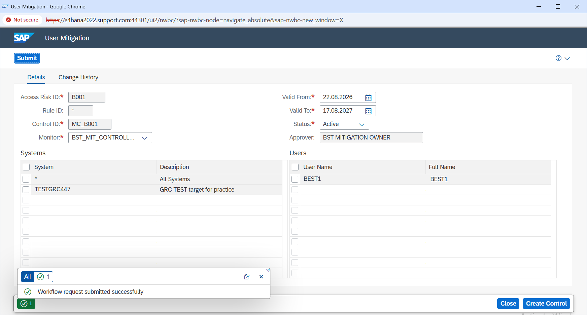
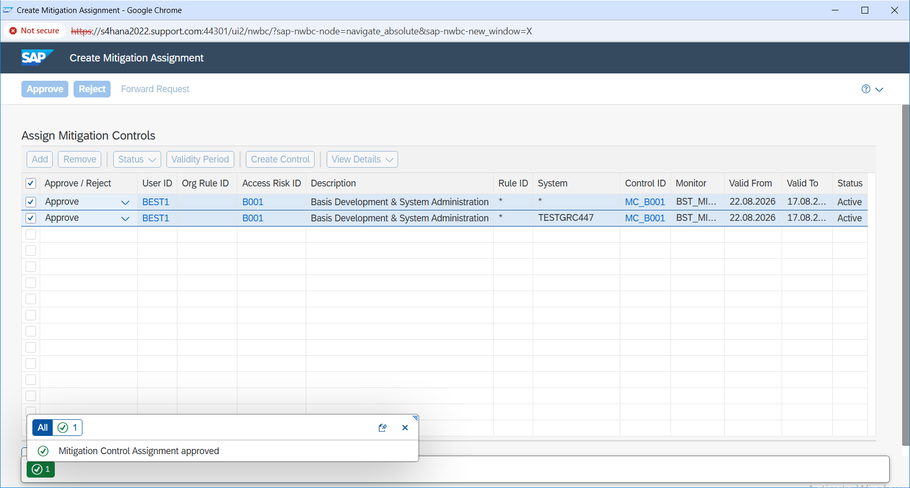

# User Mitigation Assignment

## Overview

In this step, I assigned the mitigating control to the user after the control setup was completed.

The SoD risk `B001` was already identified for user `BEST1`, and mitigating control `MC_B001` was available to handle that risk.

My focus in this step was to make sure the mitigation was assigned to the correct user, risk, and target system, with the proper validity period.

---

## Mitigation Assignment Details

| Detail | Value |
|---|---|
| User | BEST1 |
| Risk ID | B001 |
| Mitigating Control | MC_B001 |
| System | TESTGRC447 |
| Status | Active |
| Valid From | 22-Aug-2026 |
| Valid To | 17-Aug-2027 |

---

## What I Did

I opened the user mitigation assignment and selected user `BEST1`.

I connected the identified risk `B001` with mitigating control `MC_B001` for system `TESTGRC447`.

I also reviewed the validity dates to make sure the mitigation was active for the required period.

Before submitting, I checked the assignment details again to make sure the correct user, risk, control, and system were selected.

After that, I submitted the mitigation request into the workflow.

Once the request was processed, I checked the status again and confirmed that the mitigation assignment was approved.

---

## Why This Step Was Important

Creating a mitigating control alone does not reduce the risk for a specific user.

The control has to be properly assigned to the user who has the conflicting access.

In this case, I made sure that risk `B001` for user `BEST1` was linked to control `MC_B001`.

This connected the identified SoD risk to an actual mitigation instead of leaving the risk only as an analysis result.

The validity period was also important because the mitigation should only remain active for the required time and should not be treated as a permanent exception without review.

---

## Evidence

### E22 – User Mitigation Request Submitted

This screenshot shows the mitigation request submitted for user `BEST1`.

It confirms that risk `B001` was linked with mitigating control `MC_B001` for the required system.

---

### E23 – User Mitigation Approved

This screenshot shows that the mitigation request was approved successfully.

It confirms that the control assignment moved through the required process and became an approved mitigation for the user.

---

## Result

Mitigating control `MC_B001` was successfully assigned to user `BEST1` for risk `B001`.

I verified that the assignment was submitted and approved with the correct system and validity period.

At this point, the identified SoD risk had an approved mitigation in place, and I was ready to perform the final verification to make sure the mitigation was active and the access request was fully completed.