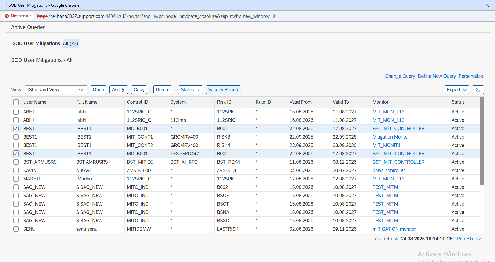
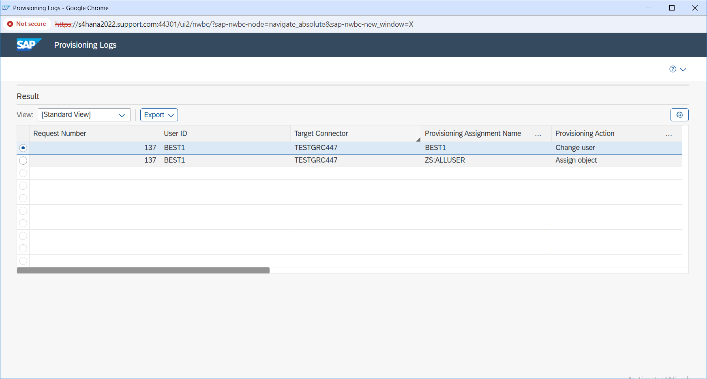

# Post-Mitigation Verification

## Overview

In this final step, I verified that the mitigation and access request were both completed properly.

I did not stop after the mitigation request showed as approved.

I checked the user mitigation details again and reviewed the access request status to make sure the risk was actually covered by an active control and the request had completed the workflow successfully.

This final verification was important because approval by itself does not always confirm that every part of the process is in the expected state.

---

## What I Verified

For user `BEST1`, I checked that:

- Risk `B001` was connected to mitigating control `MC_B001`.
- The mitigation status was active.
- The mitigation was assigned to system `TESTGRC447`.
- The validity dates were maintained correctly.
- The control assignment was approved.
- Access Request `137` was completed successfully.
- The request was no longer waiting in an approval stage.

---

## Final Mitigation Details

| Detail | Value |
|---|---|
| User | BEST1 |
| Risk ID | B001 |
| Mitigating Control | MC_B001 |
| System | TESTGRC447 |
| Status | Active |
| Valid From | 22-Aug-2026 |
| Valid To | 17-Aug-2027 |

---

## What I Did

I opened the mitigation assignment for user `BEST1` and reviewed the final status.

I confirmed that risk `B001` was still linked to control `MC_B001` and that the mitigation was active for the correct system.

I also checked the validity period to make sure the mitigation was not expired or incorrectly assigned.

After verifying the mitigation, I went back to Access Request `137` and checked the final request status.

This helped me confirm that the access request had completed the approval process and that the mitigation was in place for the identified SoD risk.

I wanted to verify both sides of the process together instead of checking only the request or only the mitigation.

---

## Why This Step Was Important

The main purpose of the project was not just to identify a risk or create a control.

The important part was making sure the full process worked from beginning to end.

The user received the required access, the SoD risk was identified before approval, the request moved through the required approvals, the access was provisioned, and the risk was covered with an active mitigating control.

By checking the final state, I was able to confirm that the process was completed properly and there was evidence for both the access decision and the risk treatment.

---

## Evidence

### E24 – Active Mitigation Verification

This screenshot shows the final mitigation status for user `BEST1`.

It confirms that risk `B001` was linked to mitigating control `MC_B001` and that the mitigation was active for system `TESTGRC447`.

I used this screen to verify that the approved mitigation was actually in place and active.

---

### E25 – Access Request 137 Approved and Completed

This screenshot shows the final status of Access Request `137`.

It confirms that the request completed the approval process successfully and was no longer pending.

I used this as the final check to make sure the access request and mitigation process were both completed as expected.

---

## Final Result

The final verification confirmed that Access Request `137` was completed successfully and that the identified SoD risk `B001` had an active mitigating control assigned to user `BEST1`.

The complete process covered:

**Access Request → Risk Analysis → Manager Approval → Role Owner Approval → Provisioning → Mitigating Control → User Mitigation Assignment → Final Verification**

This gave me a complete view of how SAP GRC can handle a business-required access request when an SoD risk is identified.

Instead of only approving the access, I worked through the full governance process and verified that the risk was properly managed before closing the project.