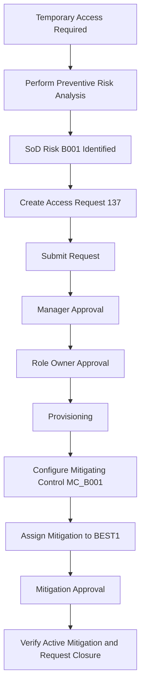

# SAP GRC ARM – Access Request and Risk Mitigation

## Project Overview

In this project, I worked on an end-to-end SAP GRC Access Request Management process.

The main goal was to understand what happens when a user requests access that creates a Segregation of Duties (SoD) risk, but the access is still needed for business purposes.

I created an access request for user `BEST1`, performed preventive risk analysis, reviewed the identified SoD conflict, followed the request through manager and role-owner approvals, configured a mitigating control, assigned the mitigation to the user, and finally verified that both the access request and mitigation were completed successfully.

I captured screenshots at each important stage so the complete process can be followed from the initial risk check to final verification.

---

## Business Scenario

User `BEST1` required temporary access to role `ZS:ALLUSER` in system `TESTGRC447`.

Before allowing the access to move through the approval process, I performed a preventive risk simulation.

The analysis identified SoD risk `B001`.

### Risk Identified

| Detail | Value |
|---|---|
| Risk ID | B001 |
| Rule ID | 0001 |
| Risk Level | Medium |
| Conflicting Functions | BS02 and BS11 |
| Conflicting Actions | CMOD and /SAPDMC/LSMW |
| Requested Role | ZS:ALLUSER |
| Target System | TESTGRC447 |

Since the access was required temporarily, I did not remove the requested role. Instead, I continued with the approval process and handled the identified risk using a mitigating control.

---

# What I Did

## 1. Performed Preventive Risk Analysis

Before completing the access request, I ran a user-level risk simulation.

The simulation identified risk `B001`. I reviewed the risk details, including the conflicting functions, actions, affected role, system, and risk level.

This step helped me confirm that the requested access introduced an SoD conflict before the access was approved.

**Result:** Risk `B001` was identified during preventive analysis.

📁 [View Preventive Risk Simulation Evidence](02-preventive-risk-simulation/evidence/)

---

## 2. Created and Submitted the Access Request

After reviewing the risk, I created Access Request `137` for user `BEST1`.

### Request Details

| Detail | Value |
|---|---|
| Request Number | 137 |
| User | BEST1 |
| Request Type | Change Account |
| Priority | Medium |
| Requested Role | ZS:ALLUSER |
| System | TESTGRC447 |
| Role Valid From | 22-Aug-2026 |
| Role Valid To | 30-Sep-2026 |

I also included the business reason for why the temporary access was required.

After reviewing the request information, I submitted it into the approval workflow.

**Result:** Access Request `137` was submitted successfully and moved to the approval process.

📁 [View Access Request Evidence](01-access-request/evidence/)

---

## 3. Followed the Approval Workflow

After submitting the request, I followed Request `137` through the configured approval stages.

The request first went to the manager approval stage.

I reviewed the manager work item and verified that the manager approval was completed successfully.

After manager approval, the request moved to the role-owner approval stage.

I then verified that the role-owner approval was also completed.

I also checked the audit trail and provisioning log instead of only relying on the approval message.

**Result:** The request completed both manager and role-owner approval stages and moved through provisioning successfully.

📁 [View Workflow Approval Evidence](03-workflow-approval/evidence/)

---

## 4. Configured a Mitigating Control

Because risk `B001` could not simply be removed by taking away the requested access, I configured mitigating control `MC_B001`.

The control was created for the identified risk and applicable system.

I also maintained separate responsibilities for the person approving the mitigation and the person monitoring the control.

### Control Responsibility

| Responsibility | User |
|---|---|
| Mitigation Approver | BST_MITOWN1 |
| Control Monitor | BST_MITCNT1 |

I intentionally used different users for these responsibilities so the same person was not both approving and monitoring the mitigation.

This helped maintain separation of responsibility within the mitigation process.

**Result:** Mitigating control `MC_B001` was saved with separate approver and monitor responsibilities.

📁 [View Mitigation Control Evidence](04-mitigation-control/evidence/)

---

## 5. Assigned the Mitigation to the User

After the mitigating control was available, I assigned control `MC_B001` to user `BEST1` for risk `B001`.

### Mitigation Assignment

| Detail | Value |
|---|---|
| User | BEST1 |
| Risk | B001 |
| Mitigating Control | MC_B001 |
| System | TESTGRC447 |
| Status | Active |
| Valid From | 22-Aug-2026 |
| Valid To | 17-Aug-2027 |

The mitigation request was submitted and then approved through the workflow.

**Result:** Risk `B001` for user `BEST1` was covered by an active mitigating control.

📁 [View User Mitigation Assignment Evidence](05-user-mitigation-assignment/evidence/)

---

## 6. Verified the Final Result

I did not stop after receiving the approval confirmation.

As the final step, I checked the system again to make sure the request and mitigation were actually in the expected state.

I verified that:

- Access Request `137` was approved.
- The provisioning log was available.
- User `BEST1` had an active mitigation assignment.
- Risk `B001` was connected to control `MC_B001`.
- The mitigation was assigned to the correct target system.
- Separate approver and monitor responsibilities were maintained.
- The mitigation validity dates were active.

**Result:** The access request, approval workflow, provisioning, and mitigation were all successfully verified.

📁 [View Post-Mitigation Verification Evidence](06-post-mitigation-verification/evidence/)

---

# End-to-End Workflow



---

# Project Evidence

I organized the screenshots based on each stage of the process so the workflow can be reviewed in order.

```text
sap-grc-arm-access-request-mitigation/
│
├── 01-access-request/
│   └── evidence/
│       ├── E13-arm-request-137-submitted.png
│       └── E14-request-137-decision-pending.png
│
├── 02-preventive-risk-simulation/
│   └── evidence/
│       └── E12-preventive-risk-simulation.png
│
├── 03-workflow-approval/
│   └── evidence/
│       ├── E15-workflow-routing-audit-log.png
│       ├── E16-manager-approval-workitem.png
│       ├── E17-manager-approval-completed.png
│       ├── E18-role-owner-approval-stage.png
│       ├── E19-role-owner-approval-completed.png
│       └── E20-provisioning-log.png
│
├── 04-mitigation-control/
│   └── evidence/
│       └── E21-control-owner-monitor-saved.png
│
├── 05-user-mitigation-assignment/
│   └── evidence/
│       ├── E22-user-mitigation-request-submitted.png
│       └── E23-user-mitigation-approved.png
│
└── 06-post-mitigation-verification/
    └── evidence/
        ├── E24-active-mitigation-verification.png
        └── E25-request-137-role-provisioned.png
```

---

## Final Outcome

The complete process started with a temporary access requirement and ended with an approved and provisioned access request that had an active mitigating control for the identified SoD risk.

The final result showed that the required access could be provided while still maintaining the necessary GRC review, approval, mitigation, and monitoring process.